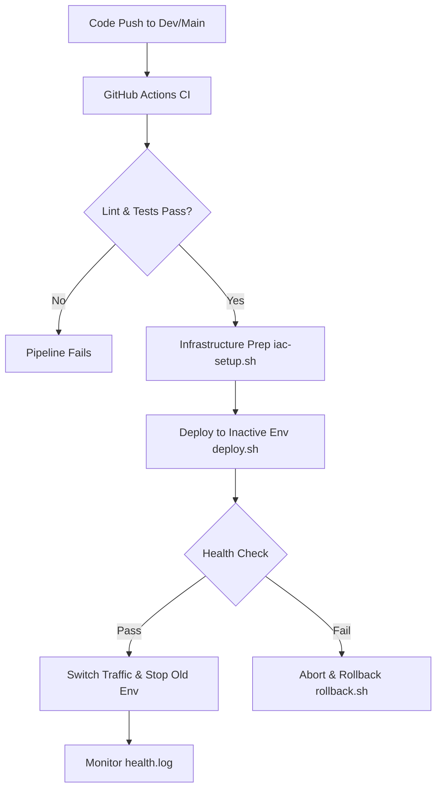

## 🛠 Tech Stack
*   **App Framework**: Node.js (Express)
*   **Testing**: Jest, Supertest
*   **Linting**: ESLint
*   **CI/CD**: GitHub Actions
*   **Automation/IaC**: Bash Scripting
*   **Process Management**: PM2
*   **Environment**: Local Production (Blue-Green Simulation)

---

## 📊 Workflow Diagram



---

## 🚀 Step-by-Step Instructions

### 1. Infrastructure as Code (Environment Preparation)
The environment setup is fully automated. Running this script installs the necessary process manager (PM2) and creates the local production directory structure (`~/local-production/blue` and `~/local-production/green`).

**Command:**
```bash
bash iac-setup.sh
```

> **Proof of IaC Execution:**
> 
> **

### 2. Continuous Integration (CI) Pipeline
Every push to the `main` or `dev` branches triggers the GitHub Actions pipeline. The pipeline automates the environment setup, dependency installation, code linting with ESLint, and unit testing with Jest.

> **Proof of Successful CI Pipeline:**
> 
> *
*

### 3. Continuous Deployment (Blue-Green Simulation)
Deployment is handled by `deploy.sh`. It identifies the current active environment, deploys the latest code to the "idle" environment, and performs a pre-flight health check. Only if the health check passes does it switch traffic and shut down the previous version.

*   **Blue Port**: 3001
*   **Green Port**: 3002

**Command:**
```bash
bash deploy.sh
```

> **Proof of Deployment & Running App:**
> 
> **
> ----
> **

### 4. Rollback Mechanism
If a deployment fails the health check, or needs to be manually reverted, the `rollback.sh` script instantly restarts the previous stable environment and updates the traffic pointer.

**Command:**
```bash
bash rollback.sh
```

> **Proof of Rollback:**
> 
> **

### 5. Monitoring & Health Checks
The `monitor.sh` script runs a background loop that pings the active environment's `/health` endpoint every 5 seconds. All results are logged with timestamps and status codes to `health.log`.

**Command:**
```bash
bash monitor.sh
```

> **Proof of Monitoring Logs:**
> 
> **
> ----
> **
